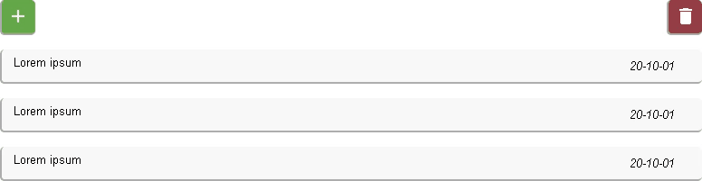

  <h1>Cloud Todo List</h1>
  <h4>Web application to manage your tasks</h4>
  
This app it is been made with:

  <lu>
    <li><a href="https://www.php.net/">PHP</a></li>
    <li><a href="https://developer.mozilla.org/es/docs/Web/HTML">HTML</a></li>
    <li><a href="https://developer.mozilla.org/es/docs/Web/CSS">CSS</a></li>
    <li><a href="https://developer.mozilla.org/es/docs/Web/JavaScript">JavaScript</a></li>
    <li><a href="https://www.apachefriends.org/es/index.html">XAMPP</a></li>
  </lu>
  
  

